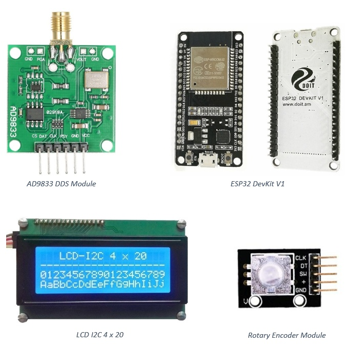
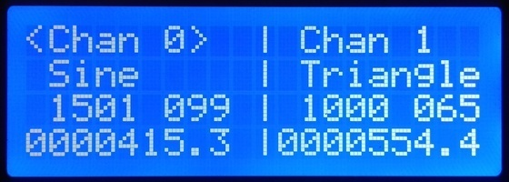
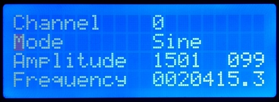
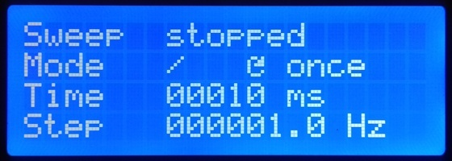
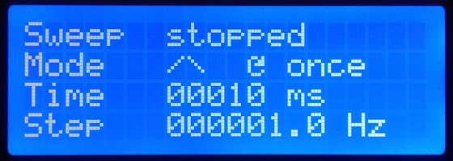
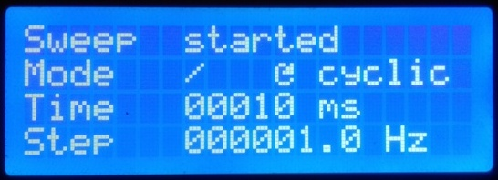

# AD9833FunctionGenerator
Yeat another AD9833 Function Generator

This project shows the use of an AD9833 breakout bord as DDS function generator.
Output frequency and waveform are set on AD9833.
Output amplitude is controlled by means of the digital potentiometer MCP41010
which controls the OPAMP AD8051 in 255 steps.
AD9833 and MCP41010 have SPI interface.
## Parts

## Screens
#### Initial Screen
Settings of both channels displayed.
Channel 0 selected, waveform is Sine, amplitude 1501mv/099, frequency 415.3Hz

#### Channel 0
Mode is selected to be changed, frequency was changed to 20415.3Hz

#### Sweep 1
``
In sweep-mode start and stop frequencies are given
by the set frequencies of channel 0 and channel 1
``

Sweep is stopped, mode is rising, once in steps of 1Hz every 10ms

#### Sweep 2
Sweep is stopped, mode is rising then falling, once in steps of 1 Hz every 10ms

#### Sweep 3
Sweep is started, mode is rising, cyclic in steps of 1Hz every 10ms

## Code
The folder AD9833FunctionGenerator contains the full PlatformIO project
